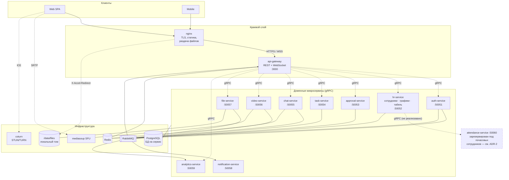
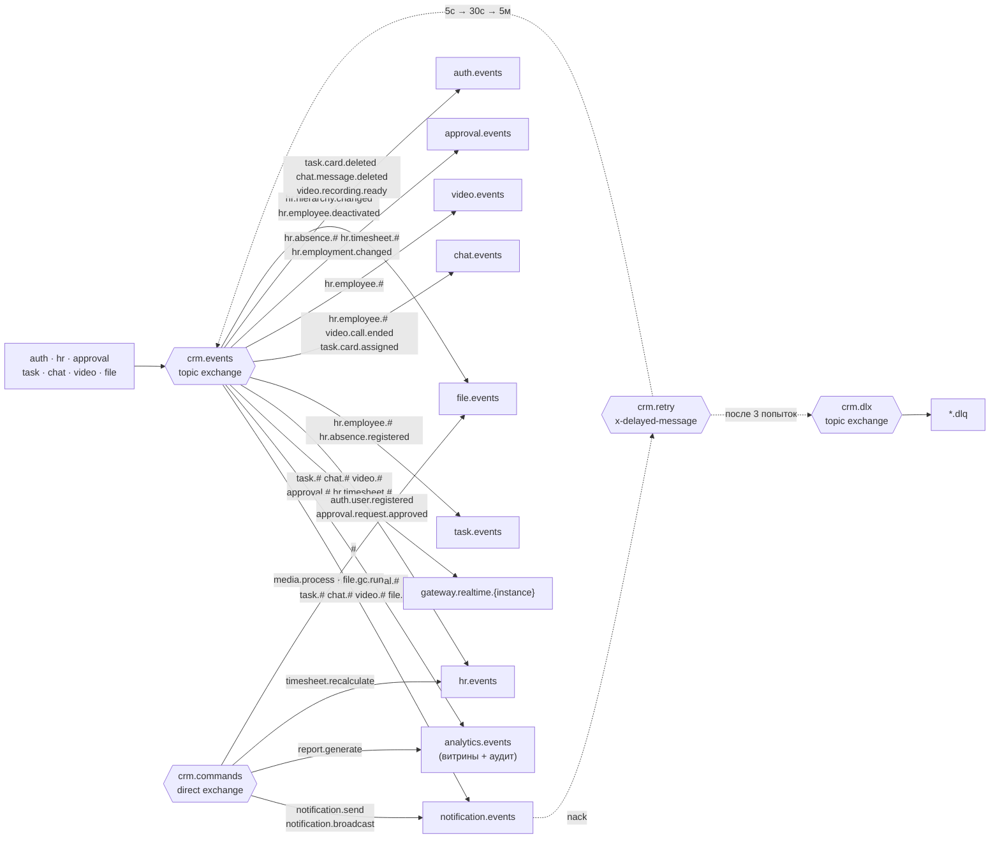
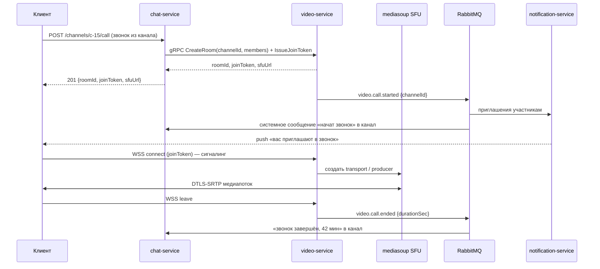
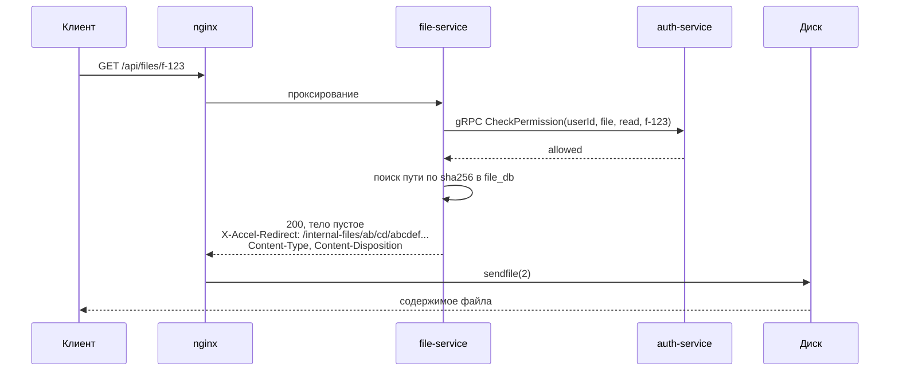
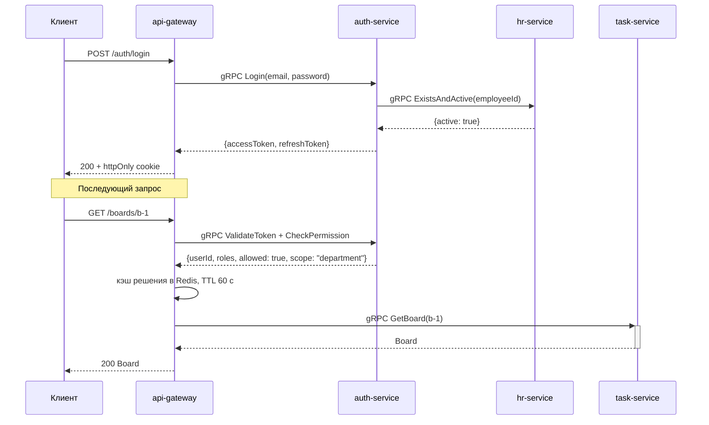
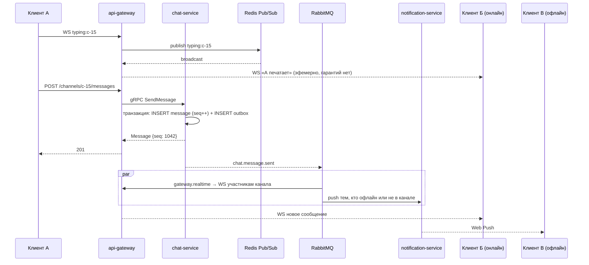
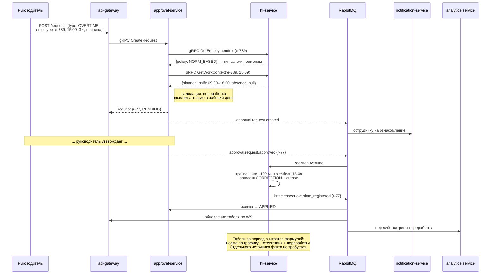
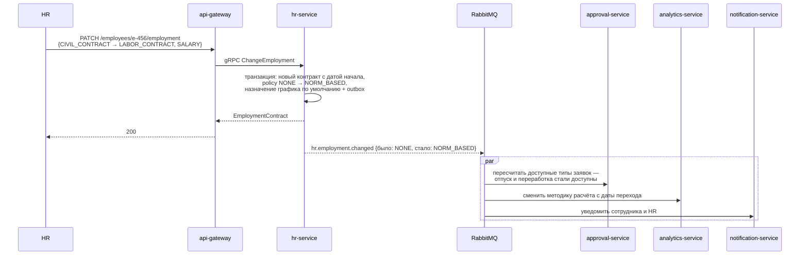
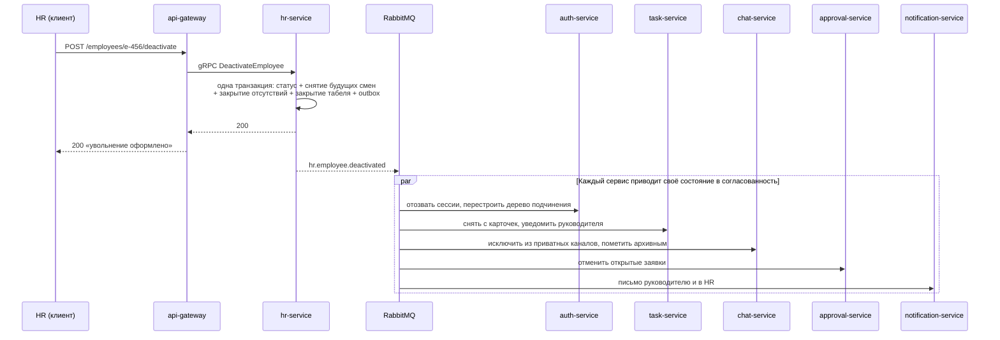

# Архитектура CRM-системы учёта работы сотрудников

**Стек:** NestJS (TypeScript), gRPC (синхронное взаимодействие), RabbitMQ (асинхронное), Redis (кэш и эфемерные сигналы), PostgreSQL, локальное файловое хранилище, Docker / Docker Compose.

**Позиционирование продукта:** open source, self-hosted. Развёртывание одной командой `docker compose up` на собственном сервере организации, без внешних облачных зависимостей.

Документ описывает **декомпозицию системы на микросервисы и способы обмена сообщениями между ними**. Реализация кода, схемы БД и UI — вне рамок этого документа.

---

## 1. Функциональные подсистемы и допущения

| Подсистема | Что делает |
|---|---|
| Учёт сотрудников | Профили, оргструктура (отделы, должности, руководители), **типы найма** |
| Графики работы | Шаблоны графиков, смены, назначение смен, отпуска/отгулы |
| Табель и переработки | Норма рабочего времени по графику, согласованные переработки, закрытие периода |
| Согласования | Заявки сотрудников и их утверждение руководителями (отпуск, переработка, обмен сменами, закрытие табеля) |
| Kanban-доска | Доски, колонки, карточки, исполнители, WIP-лимиты, комментарии |
| Корпоративный чат | Каналы, личные сообщения, треды, упоминания, вложения, поиск |
| Видеозвонки | Комнаты, WebRTC-сигналинг, SFU-медиасервер, запись |
| Уведомления | E-mail, push, in-app |
| Отчётность | Сводки по рабочему времени, загрузке, продуктивности |

**Принятые допущения** (важно зафиксировать в пояснительной записке):

1. Декомпозиция выполнена по **ограниченным контекстам (bounded contexts)** предметной области, а не по техническим слоям и **не по ролям пользователей**.
2. Каждый сервис владеет собственной базой данных — **Database per Service**. Прямых обращений к чужой БД нет.
3. Согласованность данных между сервисами — **eventual consistency** через события в RabbitMQ. Распределённых XA-транзакций нет.
4. **Фактическое время прихода и ухода не фиксируется.** Подавляющее большинство сотрудников работает по трудовому договору с окладом, где рабочее время определено договором и графиком, а не измерением. Учёт строится на **норме по графику**, из которой вычитаются отсутствия и к которой прибавляются согласованные переработки (см. ADR-2).
5. Модель сотрудника поддерживает **разные типы найма** (трудовой договор, ГПХ, самозанятый, ИП, аутстафф, стажировка). Тип найма определяет, какие подсистемы к сотруднику вообще применимы.
6. Медиапоток видеозвонков (RTP/SRTP) **не проходит** через gRPC или RabbitMQ — это отдельный транспорт WebRTC (см. §7.3).
7. **Файлы хранятся на локальной файловой системе сервера**, объектные хранилища (S3, MinIO) не используются. Следствие: `file-service` — единственный сервис, привязанный к конкретному узлу (см. §8.6).
8. Целевая нагрузка — организация до ~500 сотрудников, один физический/виртуальный сервер. Горизонтальное масштабирование заложено там, где оно бесплатно, но не является требованием.
9. Внешние платные сервисы (FCM, SendGrid, Twilio) — опциональные плагины; базовая конфигурация обходится SMTP и Web Push на своей инфраструктуре.

---

## 2. Карта микросервисов

Всего **10 сервисов**: 1 краевой (edge) + 9 доменных, плюс инфраструктурные компоненты.



### 2.1. Описание сервисов

| # | Сервис | Зона ответственности | Хранилище | Почему выделен отдельно |
|---|--------|---------------------|-----------|------------------------|
| 0 | **api-gateway** | Единая точка входа, REST API, терминация JWT, rate limiting, BFF-агрегация (в т.ч. дашборд руководителя), WebSocket-хаб | Redis (сессии, WS-роутинг) | Изолирует клиента от внутренней топологии; клиент не знает про gRPC |
| 1 | **auth-service** | Вход, JWT access/refresh, отзыв токенов, роли, права, **scope-проверки «руководитель ↔ подчинённый»** | PostgreSQL `auth_db` + Redis | Точка безопасности; вызывается всеми, меняется по своим причинам |
| 2 | **hr-service** | Сотрудники, отделы, должности, иерархия, **типы найма**, приём/увольнение; шаблоны графиков, смены, отсутствия, производственный календарь; **табель и переработки** | PostgreSQL `hr_db` | Единый контекст «персонал и его рабочее время» (ADR-1, ADR-2) |
| 3 | **approval-service** | Заявки и маршруты согласования: отпуск, отгул, переработка, обмен сменами, закрытие периода. Делегирование, эскалация, SLA | PostgreSQL `approval_db` | Сквозной бизнес-процесс со своим состоянием и правилами (ADR-3) |
| 4 | **task-service** | Kanban: доски, колонки, карточки, порядок, исполнители, метки, чек-листы, комментарии, WIP-лимиты | PostgreSQL `task_db` | Самостоятельный контекст с собственной моделью и высокой частотой изменений |
| 5 | **chat-service** | Каналы (публичные/приватные), личные и групповые переписки, сообщения, треды, реакции, упоминания, счётчики непрочитанного, полнотекстовый поиск | PostgreSQL `chat_db` + Redis | Самая высокая частота записи в системе; отдельный профиль хранения и индексации (ADR-5) |
| 6 | **video-service** | Комнаты звонков, WebRTC-сигналинг (WebSocket), управление SFU (mediasoup), права участников, метаданные записей | PostgreSQL `video_db` + Redis | Stateful, sticky-соединения, особое масштабирование |
| 7 | **file-service** | Приём и отдача файлов на локальном диске: аватары, вложения чата и карточек, записи звонков; дедупликация, превью, квоты, сборка мусора | Локальный том `/data/files` + PostgreSQL `file_db` | Особый профиль нагрузки (большие тела запросов), переиспользуется всеми |
| 8 | **notification-service** | E-mail (SMTP), Web Push, in-app уведомления, шаблоны, настройки подписок, тихие часы | PostgreSQL `notification_db` | **Практически чистый потребитель RabbitMQ** |
| 9 | **analytics-service** | Отчёты и дашборды: использование рабочего времени, соблюдение графика, скорость выполнения задач, загрузка, статистика встреч. Read-модели (CQRS) + журнал аудита | PostgreSQL `analytics_db` | Тяжёлые агрегирующие запросы не должны конкурировать с OLTP-нагрузкой |
| — | ~~attendance-service~~ | **Зарезервирован**, не реализуется. Фактический учёт прихода/ухода для сотрудников с почасовой оплатой | `attendance_db` | Не нужен при окладной форме оплаты (ADR-2) |

### 2.2. Инфраструктурные компоненты (не микросервисы)

| Компонент | Назначение |
|---|---|
| **nginx** | TLS-терминация, раздача SPA, **отдача файлов с диска через `X-Accel-Redirect`** (§8.3) |
| **RabbitMQ** | Брокер асинхронных сообщений, management UI на :15672 |
| **PostgreSQL** | По одной БД на сервис (в стенде — один инстанс, отдельные базы и роли) |
| **Redis** | Кэш, refresh-токены и blacklist, presence, счётчики непрочитанного, **Pub/Sub для эфемерных realtime-сигналов** |
| **mediasoup SFU** | Селективный форвардинг медиапотоков WebRTC |
| **coturn** | STUN/TURN-сервер для обхода NAT |

---

## 3. Модель найма и её влияние на архитектуру

Раздел вводит сквозной атрибут, от которого зависит поведение половины системы. Он появился раньше остальных разделов не случайно: без него не обосновать ADR-2.

### 3.1. Две независимые характеристики

Распространённая ошибка — свалить всё в один перечислимый тип. Но «почасовая оплата» и «ГПХ» — величины разной природы: первая описывает *как считают деньги*, вторая — *какая правовая форма отношений*. Они комбинируются, поэтому в модели их две:

**`employment_type` — правовая форма отношений**

| Значение | Расшифровка |
|---|---|
| `LABOR_CONTRACT` | Трудовой договор (бессрочный или срочный) |
| `CIVIL_CONTRACT` | Договор ГПХ — подряда или возмездного оказания услуг |
| `SELF_EMPLOYED` | Самозанятый (налог на профессиональный доход) |
| `ENTREPRENEUR` | Индивидуальный предприниматель |
| `OUTSTAFF` | Сотрудник по договору аутстаффинга/аутсорсинга |
| `INTERN` | Стажёр или практикант |

**`payment_form` — форма оплаты**

| Значение | Расшифровка |
|---|---|
| `SALARY` | Оклад |
| `HOURLY` | Почасовая ставка |
| `PIECEWORK` | Сдельная оплата |
| `PER_ACT` | По акту выполненных работ |

Дополнительно: `rate` (ставка — 1.0, 0.5, 0.25) как отдельное числовое поле, а не как ещё один тип. Совместительство и неполный день — это `rate`, а не новая правовая форма.

### 3.2. Производная величина: политика учёта времени

Из пары «тип найма + форма оплаты» выводится **`time_tracking_policy`** — единственная величина, по которой ветвится код:

| `employment_type` | `payment_form` | → `time_tracking_policy` | Статус |
|---|---|---|---|
| `LABOR_CONTRACT` | `SALARY` | `NORM_BASED` — норма по графику | ✅ реализовано |
| `INTERN` | `SALARY` | `NORM_BASED` | ✅ реализовано |
| `OUTSTAFF` | `SALARY` | `NORM_BASED` (справочно, табель ведёт работодатель) | ✅ реализовано |
| `LABOR_CONTRACT` | `HOURLY` | `FACT_BASED` — требуется фактический учёт | ⏳ задел (§3.4) |
| `LABOR_CONTRACT` | `PIECEWORK` | `DELIVERABLE_BASED` — по объёму работ | ⏳ задел |
| `CIVIL_CONTRACT` | `PER_ACT` | `DELIVERABLE_BASED` — по акту | ⏳ задел |
| `SELF_EMPLOYED` | `PER_ACT` | `NONE` — время не учитывается | ✅ реализовано |
| `ENTREPRENEUR` | `PER_ACT` | `NONE` | ✅ реализовано |

**Ключевое проектное решение: код ветвится по политике, а не по типу найма.** Добавление нового типа найма — это одна строка в таблице соответствия, без изменения логики. Если бы `switch` стоял на `employment_type`, каждое новое значение требовало бы правок в табеле, согласованиях, отчётности и уведомлениях.

### 3.3. Что применимо к каждой политике

| Возможность | `NORM_BASED` | `FACT_BASED` | `DELIVERABLE_BASED` | `NONE` |
|---|:---:|:---:|:---:|:---:|
| График работы и смены | да | да | нет | нет |
| Табель рабочего времени | да (расчётный) | да (по факту) | нет | нет |
| Заявка на отпуск / отгул | да | да | **нет** | **нет** |
| Больничный | да | да | нет | нет |
| Заявка на переработку | да | автоматически | нет | нет |
| Учёт прихода/ухода | **нет** | да | нет | нет |
| Отчётность по закрытым задачам | опционально | опционально | **основная** | основная |
| Kanban, чат, звонки | да | да | да | да |

Обратите внимание на два «нет» в строке отпуска: у исполнителя по ГПХ или самозанятого **нет** права на отпуск и больничный, потому что нет трудовых отношений. `approval-service` обязан отклонять такие заявки на этапе создания — это не UI-ограничение, а доменное правило.

> **Отдельно про ГПХ и самозанятых.** Для них учёт рабочего времени не просто не нужен — он **противопоказан**. Установленный график, подчинение внутреннему распорядку и табелирование входят в перечень признаков, по которым налоговый орган и суд переквалифицируют гражданско-правовой договор в трудовой со всеми доначислениями. Система, которая по умолчанию заводит на такого исполнителя график и табель, создаёт заказчику риск на ровном месте. Поэтому политика `NONE` — это не «функциональность отключена», а **защитное поведение по умолчанию**: соответствующие разделы интерфейса для таких сотрудников не просто скрыты, а недоступны на уровне доменных правил `hr-service` и `approval-service`.

### 3.4. Задел под фактический учёт времени

Требование — заложить возможность, не реализуя её. Задел состоит из пяти зафиксированных элементов:

1. **Политика `FACT_BASED` объявлена** в перечислении и в таблице соответствия §3.2. Обработчик существует и возвращает `UNIMPLEMENTED` — то есть путь в коде есть, он просто пуст.

2. **Интерфейс-шов в модуле табеля.** Расчёт табеля построен на стратегии:

   ```ts
   interface WorkedTimeSource {
     getWorkedMinutes(employeeId: string, period: Period): Promise<WorkedTime[]>;
   }

   // Реализовано: норма из графика минус отсутствия
   class PlannedTimeSource implements WorkedTimeSource { ... }

   // Задел: gRPC-клиент к будущему attendance-service
   class TrackedTimeSource implements WorkedTimeSource {
     getWorkedMinutes() { throw new UnimplementedException('attendance-service'); }
   }
   ```

   Выбор реализации — по `time_tracking_policy` сотрудника. Появление реального учёта означает написать одну реализацию интерфейса и поднять контейнер; ни табель, ни согласования, ни отчётность при этом не меняются.

3. **Формат ответа уже учитывает будущее.** `GetTimesheet` возвращает записи с полем `source: PLAN | FACT | CORRECTION`. Сегодня во всех записях `PLAN`, но потребители (аналитика, выгрузки, интерфейс) написаны так, что появление `FACT` не ломает контракт и не требует версионирования события.

4. **Контракт будущего сервиса объявлен заранее.** Файл `libs/contracts/proto/attendance.proto` существует и содержит интерфейс `AttendanceService` (`CheckIn`, `CheckOut`, `GetWorkedTime`, `ApplyCorrection`), но ни один сервис его не реализует. Смысл: граница зафиксирована **до** появления кода, пока нет соблазна её размыть. Это же документирует намерение для контрибьюторов open source проекта.

5. **Зарезервированы имена и адреса:** порт `50060`, база `attendance_db`, очередь `attendance.events`, префикс routing key `attendance.*`. Ни одно из них не используется под другие нужды.

Чего в заделе намеренно **нет**: контейнера, схемы БД, подписок на события и упоминаний в `docker-compose`. Задел — это зафиксированная граница и пустая реализация интерфейса, а не работающий каркас. Каркас пришлось бы поддерживать, не получая от него пользы.

---

## 4. Пересмотр границ сервисов (ADR)

Раздел фиксирует пять решений о границах, каждое — с рассмотренной альтернативой. Именно эта часть обычно вызывает вопросы на защите.

### ADR-1. Графики работы — модуль внутри `hr-service`, а не отдельный микросервис

**Решение принято в пользу объединения.** Первоначальный вариант с отдельным `schedule-service` отвергнут.

| Аргумент за объединение | Разбор |
|---|---|
| Общий жизненный цикл | Каждая смена и каждое отсутствие принадлежат сотруднику и не существуют без него. Приём на работу → назначение графика; увольнение → снятие будущих смен. Это один сценарий, а не два |
| Распределённая согласованность превращается в локальную транзакцию | «Уволили → снять будущие смены» было событием `employee.deactivated` → потребитель в отдельном сервисе с дедупликацией, retry и DLQ. Стало — один `UPDATE` в одной транзакции. Целый класс отказов исчезает |
| Табель вычисляется из графика | После отказа от `attendance-service` (ADR-2) табель считается как «норма по графику − отсутствия + переработки». Все три слагаемых принадлежат одному сервису. Разделение означало бы вычислять официальный кадровый документ через сеть |
| Один пользователь, один интерфейс | Оргструктурой, графиками и табелем управляет один человек (HR или руководитель) в одном разделе. Разрыв границы сервиса посреди сценария не соответствует предметной области |
| Объём домена не оправдывает сервис | Накладные расходы на отдельный сервис — свой контейнер, БД, миграции, healthcheck, CI, набор потребителей событий, мониторинг — превышают сложность самого домена |
| Self-hosted | Каждый лишний контейнер — плюс к порогу входа для того, кто разворачивает систему у себя |

> **Правка обоснования после ADR-2.** В первой редакции документа главным аргументом было устранение «болтливой» пары вызовов `attendance → schedule` + `attendance → employee` на каждой отметке прихода. Этот аргумент **отпал вместе с самим сервисом** — отметок прихода больше нет. На его место встал более сильный: табель теперь вычисляется из графика и отсутствий, то есть данные связаны не просто часто используемым запросом, а формулой. Вывод не изменился, но опираться он должен на актуальный довод, а не на исчезнувший.

**Что говорит против объединения и почему это не перевесило:** разный темп изменений (оргструктура стабильна, смены меняются еженедельно) и потенциальный рост домена, если появится автоматическое планирование смен с оптимизацией. Оба довода касаются *будущего*, а не текущих требований.

**Размер получившегося сервиса:** 9 агрегатов (`Employee`, `Department`, `Position`, `ManagerLink`, `EmploymentContract`, `ScheduleTemplate`, `Shift`, `Absence`, `TimesheetPeriod`). Сопоставимо с `task-service` (`Board`, `Column`, `Card`, `Label`, `Checklist`, `Comment`) — не «god service».

**Шов для будущего разделения.** Граница не стирается, а понижается с уровня сети до уровня модуля:

- три независимых модуля: `apps/hr-service/src/staff/`, `.../schedule/`, `.../timesheet/`;
- в proto-пакете `hr` объявлены **три gRPC-сервиса** — `StaffService`, `ScheduleService`, `TimesheetService`;
- модули не импортируют репозитории друг друга, общаются только через доменные сервисы;
- routing key событий сохраняют разные префиксы агрегатов: `hr.employee.*`, `hr.shift.*`, `hr.timesheet.*`.

Выделение любого модуля обратно в контейнер сводится к переносу папки и смене URL у gRPC-клиента; контракты не меняются.

### ADR-2. Фактический учёт прихода и ухода не ведётся; `attendance-service` не создаётся

**Решение:** сервис учёта фактического рабочего времени исключён из системы. Табель рассчитывается от нормы.

**Обоснование от предметной области.** При окладной форме оплаты по трудовому договору рабочее время сотрудника определено договором и графиком, а не измерением. Оклад выплачивается за отработанный месяц независимо от того, пришёл сотрудник в 9:00 или в 9:20. Фиксация фактического времени в этой схеме не влияет **ни на одно** решение: ни на расчёт зарплаты, ни на табель, ни на отчётность. Значит, это данные, собираемые без назначения.

Формула табеля при `NORM_BASED`:

```
Отработано за период = Норма по графику
                     − Отсутствия (отпуск, больничный, отгул)
                     + Согласованные переработки
```

Все три слагаемых уже есть в `hr-service`: норма — из шаблона графика и производственного календаря, отсутствия — из согласованных заявок, переработки — тоже из согласованных заявок. Отдельного источника данных не требуется, а значит, не требуется и сервиса.

| Что делал `attendance-service` | Судьба |
|---|---|
| `CheckIn` / `CheckOut` | **Удалено.** Не влияет ни на одно решение при окладе |
| Расчёт опозданий и отклонений | **Удалено.** Дисциплинарный контроль — не задача этой системы (см. ниже) |
| Табель за период, закрытие периода | → модуль `timesheet` в `hr-service`, расчётный |
| Переработки | → заявка в `approval-service` → запись в `hr-service` |
| Корректировки табеля | → заявка в `approval-service` → запись в `hr-service` |
| Сверка плана и факта | **Удалено.** Факта нет по построению |

**Что даёт удаление сервиса, помимо минус одного контейнера:**

- исчезает самая частая операция записи в системе (две отметки в день на каждого сотрудника → ~1000 записей в день на 500 человек) вместе с её нагрузкой и хранением;
- исчезает целый класс граничных случаев: забыл отметиться, отметился дважды, отметился не с того устройства, работал из дома, уехал к клиенту, отметка в ночную смену через полночь. Каждый из них потребовал бы правил, интерфейса ручной корректировки и потока согласований;
- исчезает необходимость в геолокации и привязке к устройству, а с ними — обработка персональных данных о перемещениях сотрудника.

**Продуктовая позиция.** Для open source self-hosted CRM отказ от слежки за приходом и уходом — не упрощение, а осознанное свойство продукта. Система планирует и учитывает работу, но не контролирует присутствие. Это снижает сопротивление внедрению внутри компании и снимает с проекта репутацию «системы надзора».

**Что сохранено из исходного разделения «план vs факт».** Ничего — потому что факта больше нет. В первой редакции документа это разделение обосновывало отдельный сервис; после отказа от фиксации фактического времени обосновывать стало нечего. Честнее убрать аргумент, чем оставить его в качестве украшения.

**Возврат сервиса при появлении почасовых сотрудников.** Как только в организации появляется сотрудник с политикой `FACT_BASED`, `attendance-service` возвращается — но уже как обслуживающий **меньшинство** сотрудников, а не всех. Задел под это описан в §3.4. Обратите внимание: при таком возврате линия разреза проходит именно там, где нужно — сервис учёта факта отделён от сервиса плана, потому что теперь у них действительно разные профили нагрузки и разная аудитория.

### ADR-3. `manager-service` не создаётся; вместо него — `approval-service`

**Проблема.** «Особый функционал для менеджеров» — соблазн завести сервис под роль. Это архитектурная ошибка: сервис, выделенный по роли пользователя, не имеет собственных данных, а только оркестрирует чужие. Он получился бы тонкой прослойкой, которая на каждый запрос дёргает `hr`, `task` и `analytics` — то есть распределённым монолитом с максимальной связанностью. Кроме того, роли меняются (появится «тимлид», «HR-BP», «директор»), и сервис-под-роль пришлось бы переписывать под каждую.

**Решение.** Функциональность руководителя разложена на три части, каждая — по своей природе.

**Часть 1 — процесс согласования → новый `approval-service`.**
Здесь действительно есть новый предметный контекст: *заявка* со своим жизненным циклом, маршрутом утверждения, делегированием и сроками. Она не принадлежит ни `hr`, ни `task` — она их пересекает.

Типы заявок и разделение ответственности:

| Тип заявки | Инициатор | Маршрут согласования | Кто применяет результат | Кому доступна |
|---|---|---|---|---|
| Отпуск | сотрудник | руководитель → HR | `hr-service` | `NORM_BASED`, `FACT_BASED` |
| Отгул / больничный | сотрудник | руководитель | `hr-service` | `NORM_BASED`, `FACT_BASED` |
| Обмен сменами | сотрудник | второй участник → руководитель | `hr-service` | со сменным графиком |
| Командировка | сотрудник | руководитель → HR | `hr-service` | `NORM_BASED`, `FACT_BASED` |
| **Переработка** | сотрудник или руководитель | руководитель | `hr-service` (табель) | `NORM_BASED` |
| Корректировка табеля | сотрудник | руководитель → HR | `hr-service` (табель) | `NORM_BASED`, `FACT_BASED` |
| Закрытие табеля за период | HR | руководители всех отделов | `hr-service` (табель) | — |
| Акт выполненных работ | исполнитель | руководитель → бухгалтерия | `hr-service` | `DELIVERABLE_BASED` |

Последний столбец — прямое следствие §3.3: `approval-service` при создании заявки проверяет применимость её типа к политике учёта сотрудника и отклоняет неприменимые. Заявка на отпуск от самозанятого не создаётся вообще, а не отклоняется руководителем вручную.

Состояния заявки:

```
DRAFT → PENDING(шаг 1) → PENDING(шаг 2) → ... → APPROVED → APPLIED
             ↓                  ↓                    ↓
         REJECTED           REJECTED            APPLY_FAILED
             ↓
        CANCELLED (отозвана автором) / EXPIRED (просрочен SLA)
```

Ключевой принцип: **`approval-service` владеет процессом, но не результатом.** Он не пишет отпуск в `hr_db` — он публикует `approval.request.approved`, а `hr-service` создаёт отсутствие и публикует `hr.absence.registered {requestId}`. `approval-service` подписан на это событие и по `requestId` переводит заявку в `APPLIED`. Если применить не удалось, `hr-service` публикует `hr.absence.registration_failed {requestId, reason}` — заявка уходит в `APPLY_FAILED`, руководитель получает уведомление. Это **сага с подтверждением**, а не двухфазный коммит.

**Часть 2 — права руководителя → scope-модель в `auth-service`.**
Право руководителя — это не роль «manager», а роль + *область действия*: «может утверждать заявки **своих подчинённых**». Реализация:

- `hr-service` при любом изменении оргструктуры публикует `hr.hierarchy.changed`;
- `auth-service` поддерживает денормализованную **таблицу транзитивного замыкания** `manager_subordinates(manager_id, subordinate_id, depth)` — проверка «является ли X руководителем Y» становится одним индексным поиском, без обращения к `hr-service`;
- `CheckPermission` расширяется полем `owner_id`;
- результат кэшируется в Redis (TTL 60 с), кэш инвалидируется по `hr.hierarchy.changed`.

Это даёт единообразие: любой сервис задаёт один и тот же вопрос `auth-service` и не содержит собственной логики «а начальник ли он».

**Часть 3 — интерфейсы руководителя → BFF-агрегация в `api-gateway` + read-модели `analytics-service`.**
Дашборд руководителя — это чтение, а не новый домен. `api-gateway` делает 3 параллельных gRPC-вызова с общим дедлайном 2 с; при таймауте одного блок отдаётся пустым с флагом `degraded` вместо ошибки всей страницы.

Итоговая раскладка функций руководителя:

| Функция руководителя | Где реализована | Новый код |
|---|---|---|
| Согласование отпусков, отгулов, командировок | `approval-service` → `hr-service` | сервис |
| Согласование переработок и корректировок табеля | `approval-service` → `hr-service` | сервис |
| Утверждение табеля за период | `approval-service` → `hr-service` | сервис |
| Делегирование согласования на время отпуска | `approval-service` | сервис |
| Эскалация просроченных заявок | `approval-service` (планировщик) | сервис |
| Назначение графиков и смен подчинённым | `hr-service` | scope-право |
| Постановка задач подчинённым, доступ ко всем доскам команды | `task-service` | scope-право |
| Модерация звонка: mute, kick, запись | `video-service` | флаг участника |
| Объявления в командный канал | `chat-service` | тип канала `announcement` |
| Дашборд «кто сегодня по графику / кто в отпуске / что ждёт решения» | BFF в `api-gateway` | агрегация |
| Отчёты по команде и выгрузки | `analytics-service` | read-модель |
| Приватные заметки о сотруднике, 1-on-1 | `hr-service`, модуль с доступом только руководителю и HR | модуль |

**Вывод для защиты:** из двенадцати «менеджерских» функций только пять потребовали нового сервиса — и объединяет их не роль, а общий бизнес-процесс согласования. Остальные семь — это права доступа и агрегации поверх существующих контекстов.

### ADR-4. Локальное файловое хранилище вместо объектного (S3/MinIO)

**Решение:** файлы лежат на смонтированном томе `/data/files`, отдаются nginx напрямую с диска.

| Причина | Пояснение |
|---|---|
| Соответствие продукту | Self-hosted CRM должна разворачиваться на одном сервере одной командой. Требование поднять MinIO (ещё контейнер, ключи доступа, бакеты, политики) поднимает порог входа |
| Простота резервного копирования | `tar` по каталогу + `pg_dump` — понятный администратору бэкап без внешних инструментов |
| Отсутствие лишнего слоя | MinIO поверх той же локальной ФС — HTTP-прослойка над `read()`, дающая S3-совместимость, которая в самохостинге не нужна |
| Производительность отдачи | nginx отдаёт файл через `sendfile(2)` напрямую из ядра — быстрее, чем проксирование через S3-совместимый API |

**Что теряется и чем компенсируется:**

| Потеря | Компенсация |
|---|---|
| Presigned URL «из коробки» | Подписанные ссылки на HMAC через модуль nginx `secure_link` (§8.4) |
| Файлы доступны любому инстансу | `file-service` фиксируется на одном узле — сознательное ограничение, зафиксированное в допущении 7 |
| Встроенная репликация и версионирование | Вне зоны ответственности приложения: LVM-снапшоты, rsync, ZFS — уровень администрирования |

**Шов на будущее.** В `file-service` вводится интерфейс `StorageDriver` (`put`, `get`, `stat`, `delete`, `resolvePath`) с единственной реализацией `LocalFsDriver`. Он нужен уже сейчас, чтобы подменять драйвер на `MemoryDriver` в интеграционных тестах. То, что через него позже можно добавить S3, — приятный побочный эффект, а не цель.

### ADR-5. Чат и видеозвонки — разные сервисы

Соблазн объединить их в `communication-service` (обе подсистемы — «общение», обе используют WebSocket) отвергнут: совпадает только транспорт.

| Критерий | `chat-service` | `video-service` |
|---|---|---|
| Состояние | Stateless, всё в PostgreSQL | Stateful: комнаты, транспорты, producer/consumer SFU в памяти |
| Данные | Долговременное хранение, самый большой объём записи в системе, полнотекстовый индекс | Только метаданные; сам медиапоток не хранится |
| Балансировка | Любой инстанс обслуживает любой запрос | Sticky по `roomId`: все участники комнаты — на одном инстансе |
| Профиль нагрузки | Много мелких записей в БД | Мало записей, высокая нагрузка на CPU/сеть у SFU |
| Причина отказа | Отказ БД | Исчерпание портов/полосы у SFU |
| Масштабирование | По объёму сообщений | По числу одновременных конференций |

Объединение означало бы, что отказ SFU при перегрузке конференцией уносит с собой корпоративный чат. Точки интеграции решаются штатно: звонок из канала — gRPC-вызов `chat → video`, а сообщение «звонок завершён, 42 мин» — событие `video.call.ended`, на которое подписан `chat-service`.

---

## 5. Правила выбора транспорта

В системе три транспорта межсервисного и клиентского взаимодействия. Правило, которым проверяется каждое взаимодействие:

```
Нужен ли вызывающей стороне ответ, чтобы продолжить обработку запроса пользователя?
│
├── ДА  ─────────────────────────────────────────► gRPC
│
└── НЕТ → Критична ли потеря этого сообщения?
          │
          ├── ДА (нужна гарантия доставки) ──────► RabbitMQ
          │
          └── НЕТ (данные устаревают за секунды) ► Redis Pub/Sub
```

| Критерий | gRPC | RabbitMQ | Redis Pub/Sub |
|---|---|---|---|
| Модель | Request / Response | Publish / Subscribe с очередями | Fire-and-forget broadcast |
| Гарантия доставки | Ответ или ошибка | At-least-once, durable | At-most-once, без хранения |
| Связанность | Сильная | Слабая | Слабая |
| Отказ адресата | Ошибка → circuit breaker | Сообщение ждёт в очереди | Сообщение теряется — и это приемлемо |
| Задержка | Единицы мс | От мс до секунд | Доли мс |
| Применение | Gateway → сервисы, межсервисные запросы данных | Доменные события, уведомления, аналитика, аудит | Индикатор набора текста, presence, активный спикер |

**Третий транспорт появился не для оптимизации, а по семантике.** Индикатор «пользователь печатает» живёт 3 секунды. Проведённый через durable-очередь, он при перезапуске потребителя будет доставлен спустя минуту — то есть покажет заведомо ложную информацию. Такие сигналы обязаны теряться при сбое, и Redis Pub/Sub даёт ровно это.

Эфемерные каналы Redis:

| Канал | Содержимое | Издатель |
|---|---|---|
| `presence:updates` | online / offline / busy / in-call | api-gateway (по факту WS-соединения), video-service |
| `typing:<channelId>` | «пользователь печатает» | api-gateway → chat-service |
| `board:<boardId>:presence` | кто сейчас смотрит доску, кто перетаскивает карточку | api-gateway |
| `call:<roomId>:speaking` | активный говорящий | video-service |

> Присутствие в чате (`online`) — **не** учёт рабочего времени и никогда не используется в табеле или отчётности. Это разделение принципиально: технически данные о присутствии в системе есть, и ровно поэтому нужно явно запретить их применение для контроля дисциплины (ADR-2). В `analytics-service` presence не поступает вообще — он живёт только в Redis с TTL.

**Запрещено:** использовать RabbitMQ в режиме RPC (`replyTo` + `correlationId`) там, где применим gRPC. Это удваивает latency и превращает брокер в узкое место.

---

## 6. Синхронное взаимодействие: gRPC

### 6.1. Транспорт в NestJS

Каждый доменный сервис поднимается как гибридное приложение: gRPC-сервер для входящих вызовов + RabbitMQ-консьюмер для событий.

```ts
// main.ts доменного сервиса
const app = await NestFactory.create(AppModule);

app.connectMicroservice<MicroserviceOptions>({
  transport: Transport.GRPC,
  options: {
    package: 'hr',
    // один пакет, три gRPC-сервиса: StaffService, ScheduleService, TimesheetService — ADR-1
    protoPath: join(__dirname, '../../contracts/proto/hr.proto'),
    url: '0.0.0.0:50052',
    loader: { keepCase: true, longs: String, enums: String },
  },
});

app.connectMicroservice<MicroserviceOptions>({
  transport: Transport.RMQ,
  options: {
    urls: [process.env.RABBITMQ_URL],
    queue: 'hr.events',
    queueOptions: { durable: true, deadLetterExchange: 'crm.dlx' },
    noAck: false,
    prefetchCount: 10,
  },
});

await app.startAllMicroservices();
await app.listen(3000); // только health/metrics, наружу не публикуется
```

Адресация внутри Docker-сети — по имени контейнера: `hr-service:50052`. Отдельный service discovery (Consul/etcd) не нужен, DNS Docker Compose достаточно.

### 6.2. Контракты (.proto)

Все `.proto` лежат в общем пакете монорепозитория `libs/contracts/proto/` и являются **единственным источником истины** по межсервисным интерфейсам. Изменения — только обратно совместимые (добавление полей с новыми номерами; удаление — через `reserved`).

**auth.proto**
```protobuf
syntax = "proto3";
package auth;

service AuthService {
  rpc Login                 (LoginRequest)           returns (TokenPair);
  rpc RefreshToken          (RefreshRequest)         returns (TokenPair);
  rpc ValidateToken         (ValidateTokenRequest)   returns (TokenClaims);
  rpc CheckPermission       (CheckPermissionRequest) returns (PermissionResult);
  rpc CheckPermissionsBatch (BatchPermissionRequest) returns (BatchPermissionResult);
  rpc RevokeSession         (RevokeRequest)          returns (Empty);
}

message TokenClaims {
  string user_id        = 1;
  string employee_id    = 2;
  repeated string roles = 3;
  bool   is_manager     = 4;   // есть хотя бы один подчинённый
  int64  expires_at     = 5;
}

message CheckPermissionRequest {
  string user_id     = 1;
  string resource    = 2;   // "board" | "shift" | "vacation_request" | "channel"
  string action      = 3;   // "read" | "write" | "approve" | "delete"
  string resource_id = 4;
  string owner_id    = 5;   // чей ресурс — для scope-проверки «руководитель ↔ подчинённый»
}

message PermissionResult {
  bool   allowed = 1;
  string reason  = 2;
  string scope   = 3;   // "self" | "subordinate" | "department" | "global"
}
```

**hr.proto** — один пакет, три сервиса (границы модулей сохранены, ADR-1)
```protobuf
syntax = "proto3";
package hr;

// ── Перечисления модели найма (§3) ──────────────────────────────
enum EmploymentType {
  EMPLOYMENT_TYPE_UNSPECIFIED = 0;
  LABOR_CONTRACT   = 1;   // трудовой договор
  CIVIL_CONTRACT   = 2;   // ГПХ: подряд, возмездное оказание услуг
  SELF_EMPLOYED    = 3;   // самозанятый (НПД)
  ENTREPRENEUR     = 4;   // ИП
  OUTSTAFF         = 5;   // аутстаффинг
  INTERN           = 6;   // стажёр
}

enum PaymentForm {
  PAYMENT_FORM_UNSPECIFIED = 0;
  SALARY    = 1;   // оклад
  HOURLY    = 2;   // почасовая ставка
  PIECEWORK = 3;   // сдельная
  PER_ACT   = 4;   // по акту выполненных работ
}

enum TimeTrackingPolicy {
  TIME_TRACKING_POLICY_UNSPECIFIED = 0;
  NORM_BASED        = 1;   // норма по графику            — реализовано
  FACT_BASED        = 2;   // фактический учёт            — задел, §3.4
  DELIVERABLE_BASED = 3;   // по объёму работ / актам     — задел
  NONE              = 4;   // время не учитывается вовсе  — реализовано
}

message EmploymentContract {
  string             contract_id  = 1;
  EmploymentType     type         = 2;
  PaymentForm        payment_form = 3;
  TimeTrackingPolicy policy       = 4;   // производная, §3.2
  double             rate         = 5;   // 1.0 | 0.5 | 0.25 — ставка
  int64              valid_from   = 6;
  int64              valid_to     = 7;   // 0 — бессрочный
}

// ── Сотрудники и оргструктура ───────────────────────────────────
service StaffService {
  rpc GetEmployee        (EmployeeId)          returns (Employee);
  rpc GetEmployeesBatch  (Ids)                 returns (EmployeeList);   // защита от N+1
  rpc ListByDepartment   (DepartmentRequest)   returns (EmployeeList);
  rpc GetManagerChain    (EmployeeId)          returns (EmployeeList);
  rpc GetSubordinates    (SubordinatesRequest) returns (EmployeeList);   // depth: 1 | -1
  rpc IsManagerOf        (RelationRequest)     returns (BoolResult);
  rpc ExistsAndActive    (EmployeeId)          returns (BoolResult);
  rpc GetContacts        (Ids)                 returns (ContactList);    // fallback для notification
  rpc GetEmploymentInfo  (EmployeeId)          returns (EmploymentContract);
  rpc ChangeEmployment   (ChangeEmploymentCmd) returns (EmploymentContract);
}

message Employee {
  string employee_id  = 1;
  string user_id      = 2;
  string full_name    = 3;
  string department_id = 4;
  string position     = 5;
  string manager_id   = 6;
  bool   active       = 7;
  EmploymentContract employment = 8;   // тип найма едет вместе с сотрудником
  string avatar_file_id = 9;
}

// ── Графики и отсутствия ────────────────────────────────────────
service ScheduleService {
  rpc GetShiftsForPeriod (PeriodRequest)        returns (ShiftList);
  rpc GetNormHours       (NormHoursRequest)     returns (NormHours);   // норма по производств. календарю
  rpc GetWorkContext     (WorkContextRequest)   returns (WorkContext);
  rpc GetAbsences        (PeriodRequest)        returns (AbsenceList);
  rpc AssignShifts       (AssignShiftsRequest)  returns (ShiftList);
  rpc ApplyTemplate      (ApplyTemplateRequest) returns (ShiftList);
}

// Сотрудник + его смена + отсутствие одним вызовом.
// Используется дашбордом руководителя и approval-service при валидации заявок.
message WorkContext {
  Employee employee          = 1;
  Shift    planned_shift     = 2;   // пусто, если по графику не работает или policy = NONE
  Absence  absence           = 3;   // пусто, если не в отпуске/на больничном
  bool     should_be_working = 4;
}

// ── Табель ──────────────────────────────────────────────────────
service TimesheetService {
  rpc GetTimesheet     (TimesheetRequest)   returns (Timesheet);
  rpc GetTeamTimesheet (TeamPeriodRequest)  returns (TimesheetList);  // дашборд руководителя
  rpc RegisterOvertime (OvertimeCmd)        returns (TimesheetEntry); // вызывается по approved-заявке
  rpc ApplyCorrection  (CorrectionCmd)      returns (TimesheetEntry);
  rpc ClosePeriod      (ClosePeriodCmd)     returns (TimesheetPeriod);
  rpc ExportT13        (TimesheetRequest)   returns (FileRef);        // выгрузка унифицированной формы
}

message TimesheetEntry {
  string date          = 1;
  int32  norm_minutes  = 2;   // по графику
  int32  absence_minutes = 3; // отпуск, больничный, отгул
  int32  overtime_minutes = 4;// согласованные переработки
  int32  total_minutes = 5;   // norm − absence + overtime
  Source source        = 6;

  // Задел §3.4: формат ответа готов к появлению фактического учёта,
  // сегодня во всех записях source = PLAN
  enum Source {
    PLAN       = 0;   // рассчитано от нормы графика
    FACT       = 1;   // из attendance-service — не используется
    CORRECTION = 2;   // ручная корректировка по согласованной заявке
  }
}
```

**approval.proto**
```protobuf
service ApprovalService {
  rpc CreateRequest    (CreateRequestCmd)   returns (Request);
  rpc GetRequest       (RequestId)          returns (Request);
  rpc ListPendingForMe (ApproverRequest)    returns (RequestList);  // очередь руководителя
  rpc ListMyRequests   (AuthorRequest)      returns (RequestList);
  rpc GetPendingCount  (ApproverRequest)    returns (Counter);      // бейдж в интерфейсе
  rpc Approve          (DecisionRequest)    returns (Request);
  rpc Reject           (DecisionRequest)    returns (Request);
  rpc Cancel           (RequestId)          returns (Request);
  rpc SetDelegation    (DelegationRequest)  returns (Empty);        // «на время отпуска — Петрову»
  rpc GetRoute         (RequestId)          returns (ApprovalRoute);
  rpc GetAvailableTypes (EmployeeId)        returns (RequestTypeList); // зависит от policy, §3.3
}

message Request {
  string request_id   = 1;
  string type         = 2;   // VACATION | TIME_OFF | OVERTIME | SHIFT_SWAP | TIMESHEET_FIX | TRIP | WORK_ACT
  string author_id    = 3;
  string status       = 4;   // DRAFT | PENDING | APPROVED | REJECTED | APPLIED | APPLY_FAILED | CANCELLED | EXPIRED
  int32  current_step = 5;
  repeated ApprovalStep steps = 6;
  string payload_json = 7;   // тело заявки, специфичное для типа
  int64  sla_deadline = 8;
}
```

**task.proto**
```protobuf
service TaskService {
  rpc GetBoard           (BoardRequest)    returns (Board);
  rpc MoveCard           (MoveCardRequest) returns (Card);
  rpc GetCardsByAssignee (AssigneeRequest) returns (CardList);
  rpc GetTeamWorkload    (TeamRequest)     returns (WorkloadReport);  // дашборд руководителя
  rpc GetClosedInPeriod  (PeriodRequest)   returns (CardList);        // основа акта для DELIVERABLE_BASED
  rpc GetBoardMembers    (BoardRequest)    returns (MemberList);
}
```

**chat.proto**
```protobuf
service ChatService {
  rpc CreateChannel      (CreateChannelRequest) returns (Channel);
  rpc ListChannels       (UserRequest)          returns (ChannelList);
  rpc AddMembers         (MembersRequest)       returns (Channel);
  rpc GetOrCreateDirect  (DirectRequest)        returns (Channel);
  rpc GetHistory         (HistoryRequest)       returns (MessageList);  // курсорная пагинация
  rpc SendMessage        (SendMessageRequest)   returns (Message);
  rpc EditMessage        (EditMessageRequest)   returns (Message);
  rpc DeleteMessage      (DeleteMessageRequest) returns (Empty);
  rpc AddReaction        (ReactionRequest)      returns (Message);
  rpc MarkRead           (MarkReadRequest)      returns (UnreadCounters);
  rpc GetUnreadCounters  (UserRequest)          returns (UnreadCounters);
  rpc SearchMessages     (SearchRequest)        returns (MessageList);
}

message Message {
  string message_id      = 1;
  string channel_id      = 2;
  string author_id       = 3;
  string body            = 4;
  string thread_root_id  = 5;   // пусто для сообщения верхнего уровня
  repeated string mentions       = 6;
  repeated string attachment_ids = 7;   // id из file-service
  int64  created_at      = 8;
  int64  edited_at       = 9;
  int64  seq             = 10;  // монотонный номер в канале — курсор и порядок
}
```

**video.proto**
```protobuf
service VideoService {
  rpc CreateRoom           (CreateRoomRequest) returns (Room);
  rpc GetRoom              (RoomRequest)       returns (Room);
  rpc IssueJoinToken       (JoinRequest)       returns (JoinToken);  // токен для WS-сигналинга
  rpc SetParticipantRights (RightsRequest)     returns (Empty);      // mute/kick — права модератора
  rpc StartRecording       (RoomRequest)       returns (Empty);
  rpc EndRoom              (RoomRequest)       returns (Empty);
}
```

**file.proto** — без presigned URL, вместо них подписанные ссылки и `X-Accel-Redirect`
```protobuf
service FileService {
  rpc GetFileMeta      (FileId)            returns (FileMeta);
  rpc GetFilesBatch    (Ids)               returns (FileMetaList);
  rpc IssueSignedLink  (SignedLinkRequest) returns (SignedLink);  // HMAC-ссылка, nginx secure_link
  rpc AttachToEntity   (AttachRequest)     returns (FileMeta);    // увеличить refcount
  rpc DetachFromEntity (AttachRequest)     returns (Empty);       // уменьшить refcount → кандидат на GC
  rpc GetQuotaUsage    (OwnerRequest)      returns (QuotaUsage);
}
```

**attendance.proto** — объявлен, но **не реализован** (задел §3.4)
```protobuf
syntax = "proto3";
package attendance;

// Контракт зафиксирован заранее, чтобы граница будущего сервиса была
// определена до появления кода. Ни один сервис его сегодня не реализует;
// hr-service содержит клиент-заглушку TrackedTimeSource.
service AttendanceService {
  rpc CheckIn        (CheckInRequest)      returns (AttendanceRecord);
  rpc CheckOut       (CheckOutRequest)     returns (AttendanceRecord);
  rpc GetWorkedTime  (WorkedTimeRequest)   returns (WorkedTimeList);   // ← вызовет TimesheetService
  rpc ApplyCorrection(CorrectionRequest)   returns (AttendanceRecord);
}
```

### 6.3. Матрица синхронных вызовов

| Вызывающий → Вызываемый | Метод | Зачем |
|---|---|---|
| api-gateway → auth | `ValidateToken`, `CheckPermission` | Проверка каждого входящего запроса |
| api-gateway → * | CRUD-методы | Обслуживание REST-запросов клиента |
| api-gateway → hr/approval/task | параллельный fan-out | Сборка дашборда руководителя (BFF) |
| auth → hr | `ExistsAndActive` | Запретить вход уволенному сотруднику |
| approval → hr | `GetManagerChain` | Построение маршрута согласования по оргструктуре |
| approval → hr | `GetEmploymentInfo` | **Проверка применимости типа заявки к политике учёта (§3.3)** |
| approval → hr | `GetWorkContext` | Валидация заявки: не пересекается ли отпуск со сменой |
| approval → auth | `CheckPermission` | Право на утверждение конкретной заявки |
| task → hr | `GetEmployeesBatch` | Отображение исполнителей карточек |
| task → file | `GetFilesBatch`, `AttachToEntity` | Вложения карточек |
| chat → hr | `GetEmployeesBatch` | Авторы и участники канала |
| chat → file | `AttachToEntity`, `GetFilesBatch` | Вложения сообщений |
| chat → video | `CreateRoom`, `IssueJoinToken` | Кнопка «начать звонок» в канале |
| chat → auth | `CheckPermission` | Доступ к приватному каналу |
| video → hr | `GetEmployeesBatch` | Имена и аватары участников звонка |
| video → auth | `CheckPermission` | Право на подключение к комнате |
| video → file | `AttachToEntity` | Регистрация файла записи |
| file → auth | `CheckPermission` | Право на скачивание при каждой отдаче |
| notification → hr | `GetContacts` | **Только fallback**, если локальной копии контакта нет (§7.5) |
| analytics → hr / task / approval | точечные `Get*` | Обогащение отчётов справочными данными |
| ~~hr → attendance~~ | `GetWorkedTime` | **Зарезервировано.** Клиент-заглушка `TrackedTimeSource` (§3.4) |

### 6.4. Устойчивость синхронных вызовов

| Механизм | Параметры |
|---|---|
| Deadline / timeout | 2 с по умолчанию, 5 с для отчётных вызовов, 500 мс для `CheckPermission` |
| Retry | 2 повтора с экспоненциальной задержкой, **только для идемпотентных** методов (`Get*`, `List*`, `Check*`) |
| Circuit breaker | Открывается после 5 ошибок подряд, half-open через 30 с |
| Fallback | Кэш в Redis (TTL 60 с) для справочных данных либо деградация ответа (карточка без имени исполнителя, дашборд с флагом `degraded`) |
| Health checks | gRPC Health Checking Protocol (`grpc.health.v1.Health`), используется в Docker `HEALTHCHECK` |
| Трассировка | `x-request-id`, `x-trace-id` пробрасываются через gRPC metadata сквозь всю цепочку |

**Правило против каскадных отказов:** глубина цепочки синхронных вызовов — не более 2. Если требуется больше, данные денормализуются через события. Самая длинная цепочка в системе — `gateway → chat → video` (создание звонка из канала), ровно на границе допустимого.

---

## 7. Асинхронное взаимодействие: RabbitMQ

### 7.1. Топология обменников



| Обменник | Тип | Назначение |
|---|---|---|
| `crm.events` | `topic` | Доменные события в прошедшем времени. Издатель не знает подписчиков |
| `crm.commands` | `direct` | Асинхронные команды конкретному сервису |
| `crm.retry` | `x-delayed-message` | Повторная доставка с задержкой |
| `crm.dlx` | `topic` | Dead letter exchange для неразобранных сообщений |

Все обменники и очереди — `durable: true`, сообщения — `persistent`, подтверждение — ручное (`noAck: false`).

### 7.2. Соглашение об именовании routing key

```
<контекст>.<агрегат>.<событие в прошедшем времени>

hr.employee.created
hr.employment.changed
hr.shift.assigned
hr.timesheet.closed
approval.request.approved
task.card.moved
chat.message.sent
video.call.ended
```

Контекст соответствует ограниченному контексту, а **не имени контейнера**: `hr-service` публикует `hr.employee.*`, `hr.shift.*`, `hr.absence.*` и `hr.timesheet.*` — четыре агрегата внутри одного контекста. Если модуль позже выделят в отдельный сервис (ADR-1), routing key не изменятся и подписчиков менять не придётся.

**Префикс `attendance.*` зарезервирован** под будущий сервис фактического учёта (§3.4) и сегодня не используется ни одним издателем.

### 7.3. Каталог доменных событий

**Аутентификация**

| Routing key | Payload | Подписчики и реакция |
|---|---|---|
| `auth.user.registered` | userId, email, роль | **hr** — создать заготовку профиля; **notification** — письмо-приветствие |
| `auth.password.reset_requested` | userId, token, ttl | **notification** — письмо со ссылкой |
| `auth.session.suspicious` | userId, ip, ua | **notification** — предупреждение; **analytics** |
| `auth.role.granted` | userId, roleCode, actorUserId, **auto** | **notification** — уведомить пользователя; **analytics** — журнал аудита |
| `auth.role.revoked` | userId, roleCode, actorUserId, **auto** | **notification**; **analytics** |
| `auth.user.blocked` | userId, reason, actorUserId | **notification** — уведомить пользователя и руководителя; **analytics** |
| `auth.user.unblocked` | userId, actorUserId | **notification**; **analytics** |

> **Про флаг `auto`.** Роль `MANAGER` не выдаётся вручную: она выводится из оргструктуры — появился первый подчинённый, появилась роль; не осталось ни одного, роль снимается. Это убирает целый класс обращений «руководителя назначили, а согласовывать он не может». События публикуются и для автоматических изменений: журнал аудита обязан объяснять, откуда у пользователя появилось право, иначе разбор инцидента упирается в «оно как-то само».

**Персонал (`hr-service`, модуль `staff`)**

| Routing key | Payload | Подписчики и реакция |
|---|---|---|
| `hr.employee.created` | employeeId, userId, departmentId, position, **employment{type, paymentForm, policy}** | **task** — добавить в доску отдела; **chat** — добавить в каналы отдела; **notification** — сохранить контакты; **analytics** |
| `hr.employee.updated` | employeeId, изменённые поля | **task**, **chat**, **video**, **notification** — обновить денормализованные копии ФИО/аватара/контактов |
| `hr.employment.changed` | employeeId, было/стало `{type, paymentForm, policy}` | **approval** — пересчитать доступные типы заявок, отменить ставшие неприменимыми; **analytics** — смена методики расчёта с даты; **notification** — уведомить сотрудника и HR |
| `hr.employee.deactivated` | employeeId, date, reason | **auth** — отозвать сессии; **task** — снять с карточек; **chat** — исключить из приватных каналов; **approval** — отменить открытые заявки; **notification** — уведомить руководителя. *Снятие будущих смен и закрытие табеля — локальная транзакция внутри `hr-service` (ADR-1)* |
| `hr.hierarchy.changed` | employeeId, oldManagerId, newManagerId | **auth** — перестроить таблицу замыкания и сбросить кэш прав; **approval** — пересчитать маршруты открытых заявок; **analytics** |

**Графики и отсутствия (`hr-service`, модуль `schedule`)**

| Routing key | Payload | Подписчики и реакция |
|---|---|---|
| `hr.shift.assigned` | shiftId, employeeId, start, end | **notification** — push «новая смена»; **analytics** |
| `hr.shift.changed` | shiftId, было/стало | **notification**; **analytics**. *Пересчёт табеля — локально* |
| `hr.shift.cancelled` | shiftId, employeeId, reason | **notification**; **analytics** |
| `hr.absence.registered` | **requestId**, employeeId, type, period | **approval** — заявка → `APPLIED`; **task** — пометить недоступность исполнителя; **chat** — статус «в отпуске»; **notification**; **analytics** |
| `hr.absence.registration_failed` | **requestId**, reason | **approval** — заявка → `APPLY_FAILED`; **notification** — руководителю |

**Табель (`hr-service`, модуль `timesheet`)**

| Routing key | Payload | Подписчики и реакция |
|---|---|---|
| `hr.timesheet.overtime_registered` | **requestId**, employeeId, date, minutes | **approval** — заявка → `APPLIED`; **gateway** — обновить табель в интерфейсе; **analytics** |
| `hr.timesheet.corrected` | **requestId**, employeeId, date, было/стало | **approval** → `APPLIED`; **gateway**; **analytics** |
| `hr.timesheet.closed` | period, departmentId, итоги | **analytics** — пересчёт витрин; **notification** — бухгалтерии; **gateway** |
| `hr.timesheet.reopened` | period, departmentId, reason | **analytics** — откатить витрины; **notification** |

**Согласования (`approval-service`)**

| Routing key | Payload | Подписчики и реакция |
|---|---|---|
| `approval.request.created` | requestId, type, authorId, approverIds | **notification** — согласующему; **gateway** — бейдж счётчика; **analytics** |
| `approval.request.step_passed` | requestId, step, approverId | **notification** — следующему согласующему; **gateway** |
| `approval.request.approved` | requestId, type, payload | **hr** — применить результат (отсутствие, переработка, корректировка, закрытие периода); **notification** — автору; **gateway**; **analytics** |
| `approval.request.rejected` | requestId, approverId, reason | **notification** — автору; **gateway**; **analytics** |
| `approval.request.escalated` | requestId, fromApproverId, toApproverId | **notification** — вышестоящему руководителю; **analytics** |
| `approval.delegation.set` | managerId, delegateId, period | **notification** — делегату; **auth** — временное расширение scope |

**Задачи (Kanban)**

| Routing key | Payload | Подписчики и реакция |
|---|---|---|
| `task.card.created` | cardId, boardId, authorId, assigneeId | **notification**; **gateway**; **analytics** |
| `task.card.moved` | cardId, from, to, version | **gateway** — WS-обновление доски; **analytics** — lead/cycle time |
| `task.card.assigned` | cardId, assigneeId, byUserId | **notification**; **chat** — сообщение в связанный канал; **gateway**; **analytics** |
| `task.card.commented` | cardId, authorId, mentions[] | **notification** — упомянутым; **gateway** |
| `task.card.closed` | cardId, assigneeId, closedAt, estimate | **analytics**; *в будущем — основа акта для `DELIVERABLE_BASED` (§3.2)* |
| `task.card.overdue` | cardId, assigneeId, dueDate | **notification** — исполнителю **и его руководителю** |
| `task.card.deleted` | cardId, attachmentIds[] | **file** — уменьшить refcount вложений |

**Чат**

| Routing key | Payload | Подписчики и реакция |
|---|---|---|
| `chat.channel.created` | channelId, type, creatorId, members[] | **gateway**; **notification**; **analytics** |
| `chat.member.added` / `chat.member.removed` | channelId, employeeId | **gateway**; **notification** |
| `chat.message.sent` | messageId, channelId, authorId, seq, preview | **gateway** — доставка участникам по WS; **notification** — push офлайн-участникам; **analytics** |
| `chat.message.edited` / `chat.message.deleted` | messageId, channelId, seq | **gateway**; **file** (при удалении — refcount вложений) |
| `chat.mention.created` | messageId, channelId, mentionedIds[] | **notification** — приоритетное уведомление независимо от присутствия |
| `chat.reaction.added` | messageId, emoji, userId | **gateway** |

**Видеозвонки**

| Routing key | Payload | Подписчики и реакция |
|---|---|---|
| `video.call.started` | roomId, initiatorId, invitedIds[], channelId? | **notification** — приглашения; **chat** — системное сообщение в канал; **gateway**; **analytics** |
| `video.participant.joined` / `left` | roomId, employeeId, ts | **gateway**; **analytics** |
| `video.call.ended` | roomId, durationSec, participants[] | **chat** — «звонок завершён, 42 мин»; **analytics** — статистика встреч; **task** — привязка к карточке |
| `video.recording.ready` | roomId, rawPath, sizeBytes | **file** — принять запись, поставить в очередь обработки |

**Файлы**

| Routing key | Payload | Подписчики и реакция |
|---|---|---|
| `file.upload.completed` | fileId, ownerId, sha256, size, mime | **task** / **chat** / **video** — подтвердить вложение; **analytics** |
| `file.thumbnail.ready` | fileId, thumbPath | **gateway** — обновить превью у клиента |
| `file.quota.exceeded` | ownerId, usedBytes, limitBytes | **notification** — пользователю и администратору |
| `file.storage.low` | freeBytes, totalBytes | **notification** — администратору (специфика self-hosted: диск конечен) |

### 7.4. Каталог асинхронных команд

| Routing key | Отправитель | Получатель | Смысл |
|---|---|---|---|
| `notification.send` | любой | notification | Явная отправка уведомления по шаблону |
| `notification.broadcast` | hr, chat, gateway | notification | Рассылка по отделу или всей компании |
| `report.generate` | api-gateway | analytics | Долгая генерация отчёта, результат — событием `analytics.report.ready` |
| `media.process` | video, file | file | Транскодирование записи звонка, генерация превью (ffmpeg) |
| `timesheet.recalculate` | планировщик, hr | hr | Пересчёт табеля после изменения производственного календаря задним числом |
| `file.gc.run` | планировщик | file | Удаление объектов с нулевым refcount старше 7 суток |

### 7.5. Очереди и привязки

**Одна входящая очередь на сервис.** Сервис держит одно AMQP-подключение, поэтому события и команды приходят в общую очередь, привязанную к двум обменникам с разными паттернами. Разделение на `<svc>.events` и `<svc>.commands` потребовало бы второго подключения и второго набора обработчиков — сложность без выигрыша при целевых объёмах.

| Очередь | Потребитель | Bindings в `crm.events` | Bindings в `crm.commands` | prefetch |
|---|---|---|---|---|
| `gateway.realtime.{instance}` | api-gateway (каждый инстанс) | `task.#`, `chat.#`, `video.#`, `approval.#`, `hr.timesheet.#` | — | 100 |
| `auth.events` | auth-service | `hr.employee.#`, `hr.hierarchy.changed`, `approval.delegation.set` | — | 10 |
| `hr.events` | hr-service | `auth.user.registered`, `approval.request.approved` | `timesheet.recalculate` | 10 |
| `approval.events` | approval-service | `hr.absence.registered`, `hr.absence.registration_failed`, `hr.timesheet.#`, `hr.hierarchy.changed`, `hr.employment.changed`, `hr.employee.deactivated` | — | 10 |
| `task.events` | task-service | `hr.employee.#`, `hr.absence.registered` | — | 10 |
| `chat.events` | chat-service | `hr.employee.#`, `video.call.ended`, `task.card.assigned` | — | 20 |
| `video.events` | video-service | `hr.employee.#` | — | 10 |
| `file.events` | file-service | `task.card.deleted`, `chat.message.deleted`, `video.recording.ready` | `media.process`, `file.gc.run` | 10 |
| `notification.events` | notification-service | `auth.#`, `hr.#`, `approval.#`, `task.#`, `chat.#`, `video.#`, `file.#` | `notification.send`, `notification.broadcast` | 20 |
| `analytics.events` | analytics-service | `#` | `report.generate` | 50 |
| ~~`attendance.events`~~ | — | **зарезервировано** (§3.4) | — | — |
| `<queue>.dlq` | ручной разбор / retry-воркер | из `crm.dlx` | — | — |

> **Аудит не получил отдельной очереди.** Журнал аудита и аналитические витрины строятся из одного и того же полного потока событий и обрабатываются одним процессом. Две очереди с привязкой `#` на один сервис означали бы ровно двойную доставку каждого сообщения — плату без выигрыша. Разделение станет оправданным, если аудит выделят в самостоятельный сервис.

> **`video.events` появилась при реализации.** В каталоге событий (§7.3) `video-service` числился подписчиком `hr.employee.updated` — ему нужны актуальные ФИО и аватары участников звонка, — но очередь для него не была объявлена. Несогласованность обнаружилась при генерации топологии из этой таблицы: описание, из которого напрямую создаётся инфраструктура, перестаёт расходиться с реальностью незаметно.

> **Особенность `gateway.realtime`.** Очередь объявляется с уникальным для инстанса именем (`gateway.realtime.<instance-id>`, `autoDelete: true`, `exclusive: true`), потому что WS-обновление должно прийти **на каждый** инстанс gateway, а не одному из них. Остальные очереди — общие: сообщение обрабатывает ровно один консьюмер из пула.

> **Про `notification-service`.** Он держит локальную денормализованную копию контактов (e-mail, push-подписка, настройки уведомлений, тихие часы), наполняемую событиями `auth.user.registered`, `hr.employee.created` / `hr.employee.updated`. Это сохраняет свойство «сервис без входящих gRPC» и даёт устойчивость: рассылка работает даже при недоступном `hr-service`. Цена — недостающие контакты приходится добирать методом `GetContacts`.
>
> **Ключ проекции — `userId`, а не `employeeId`.** Уведомление умеет существовать раньше кадровой карточки: приветственное письмо и ссылка на сброс пароля адресованы человеку, у которого `employeeId` ещё нет. Обратный порядок невозможен — сотрудника без учётной записи система не заводит. Поэтому `employeeId` из доменных событий переводится в `userId` через ту же проекцию, а push-подписки и настройки принадлежат логину, а не должности.
>
> **Заливка контактов при развёртывании отдельной командой не делается.** CLI, которую нужно не забыть выполнить, — это отказ, ожидающий своей очереди: забыли на новом стенде, и уведомления молча не уходят половине компании. Вместо этого недостающий контакт добирается из `hr-service` в момент первой отправки ему и остаётся в проекции; синхронный вызов происходит один раз на человека. Побочный эффект приятный: проекция самовосстанавливается и после пересоздания базы, и после событий, ушедших в DLQ.

### 7.6. Формат сообщения

Единый конверт (envelope) для всех сообщений:

```json
{
  "eventId": "018f2c3a-...-uuid-v7",
  "eventType": "approval.request.approved",
  "eventVersion": 1,
  "occurredAt": "2026-08-10T09:15:22.431Z",
  "producer": "approval-service",
  "correlationId": "req-8f1c...",
  "causationId": "018f2c39-...",
  "actor": { "userId": "u-123", "employeeId": "e-456" },
  "payload": {
    "requestId": "r-42",
    "type": "OVERTIME",
    "authorEmployeeId": "e-789",
    "date": "2026-09-15",
    "minutes": 180
  }
}
```

- `eventId` — UUID v7, используется потребителем для дедупликации.
- `correlationId` — сквозной идентификатор пользовательского запроса, позволяет собрать всю цепочку в логах.
- `causationId` — id сообщения-причины, восстанавливает дерево последствий (особенно полезно для саги согласования).
- `eventVersion` — версия схемы; при несовместимом изменении вводится новый routing key `...v2`, старый живёт до миграции всех потребителей.

### 7.7. Гарантии доставки и обработки

| Проблема | Решение |
|---|---|
| Событие потеряно при падении сервиса между коммитом в БД и публикацией | **Transactional Outbox**: событие пишется в таблицу `outbox` в той же транзакции, что и изменение данных; отдельный воркер публикует в RabbitMQ и помечает отправленным |
| Дублирование (at-least-once доставка) | **Идемпотентность потребителя**: таблица `processed_events(event_id, consumer, processed_at)` с уникальным индексом; повтор отбрасывается. Дедуп в Redis с TTL 24 ч как быстрый фильтр |
| Ошибка обработки | `nack(requeue: false)` → `crm.dlx` → retry через delayed exchange: 5 с → 30 с → 5 мин → окончательно в `*.dlq` |
| «Отравленное» сообщение | После 3 попыток уходит в DLQ, поднимается алерт, обработка очереди не блокируется |
| Нарушение порядка событий | Порядок гарантирован только внутри одной очереди при `prefetch = 1`. Там, где порядок важен, в payload передаётся `version` (карточки Kanban) или `seq` (сообщения чата); потребитель игнорирует значения ниже уже применённого |
| Сага «согласовано, но не применено» зависла | `approval-service` при переходе в `APPROVED` ставит таймер: если подтверждающее событие не пришло за 5 минут, заявка уходит в `APPLY_FAILED`, поднимается алерт |
| Перегрузка потребителя | `prefetchCount` + увеличение числа реплик консьюмера |

### 7.8. Пример реализации в NestJS

Издатель:
```ts
@Injectable()
export class EventPublisher {
  constructor(@Inject('RABBITMQ') private readonly client: ClientProxy) {}

  async publish<T>(eventType: string, payload: T, ctx: RequestContext) {
    this.client.emit(eventType, {          // emit — fire-and-forget, ответа не ждём
      eventId: uuidv7(),
      eventType,
      eventVersion: 1,
      occurredAt: new Date().toISOString(),
      producer: this.config.serviceName,
      correlationId: ctx.correlationId,
      causationId: ctx.causationId,
      actor: ctx.actor,
      payload,
    });
  }
}
```

Потребитель — замыкание саги согласования переработки:
```ts
@Controller()
export class ApprovalSagaController {
  @EventPattern('hr.timesheet.overtime_registered')
  async onOvertimeRegistered(
    @Payload() msg: Envelope<OvertimeRegistered>,
    @Ctx() ctx: RmqContext,
  ) {
    const channel = ctx.getChannelRef();
    const original = ctx.getMessage();
    try {
      if (await this.dedup.seen(msg.eventId, 'approval-service')) {
        return channel.ack(original);              // дубликат
      }
      // hr-service подтвердил, что переработка попала в табель — закрываем заявку
      await this.requests.markApplied(msg.payload.requestId);
      await this.dedup.mark(msg.eventId, 'approval-service');
      channel.ack(original);
    } catch (e) {
      this.logger.error({ eventId: msg.eventId, err: e });
      channel.nack(original, false, false);        // → crm.dlx → retry
    }
  }
}
```

---

## 8. Взаимодействие в реальном времени

### 8.1. Единое WebSocket-соединение клиента

Клиент держит **одно** WSS-соединение с `api-gateway` и через него получает всё: обновления Kanban, сообщения чата, уведомления, счётчики согласований, изменения табеля. Доменные сервисы о WebSocket-соединениях не знают вообще.

```
chat-service ──(chat.message.sent)──► RabbitMQ ──► gateway.realtime.{instance}
                                                            │
                                                     api-gateway
                                                            │
                                          WSS ──► клиенты, подписанные на channel:c-15
```

Карта «пользователь → инстанс gateway» хранится в Redis. При нескольких инстансах каждый получает копию события через собственную `autoDelete`-очередь и рассылает только своим подключённым клиентам.

Клиент подписывается на «комнаты» внутри WS-протокола: `board:<id>`, `channel:<id>`, `user:<id>`, `team:<managerId>`. Gateway перед подпиской проверяет право через `CheckPermission`.

### 8.2. Чат: два пути доставки

Здесь наглядно видно применение правила §5 — сообщения и индикаторы идут разными транспортами:

| Что | Транспорт | Почему |
|---|---|---|
| Сообщение, редактирование, удаление, реакция | RabbitMQ → gateway → WS | Потеря недопустима: сообщение обязано дойти или остаться в истории |
| «Пользователь печатает» | Redis Pub/Sub → gateway → WS | Живёт 3 секунды; доставка с задержкой хуже, чем недоставка |
| Присутствие (online/offline) | Redis Pub/Sub + TTL-ключ | Актуально только «сейчас», после перезапуска пересобирается из активных соединений |
| Прочтение (read cursor) | Redis (счётчик) + выгрузка в PostgreSQL раз в 10 с | Компромисс: мгновенно в UI, долговременно — пачкой, чтобы не писать в БД на каждое движение мыши |

Порядок сообщений в канале обеспечивается монотонным `seq`, который присваивает `chat-service` в транзакции. Клиент, обнаружив разрыв в нумерации, запрашивает пропущенное через `GetHistory` — это делает систему устойчивой к потере WS-пакетов без усложнения транспорта.

### 8.3. Видеозвонки (WebRTC)

Три независимых канала:

| Канал | Транспорт | Через какой сервис |
|---|---|---|
| **Сигналинг** (SDP offer/answer, ICE-кандидаты, join/leave) | WebSocket | `video-service` — прямое WSS-соединение клиента, **минуя** gateway (низкая задержка, stateful) |
| **Медиа** (аудио/видео, RTP/SRTP) | UDP / DTLS-SRTP | Клиент ↔ **mediasoup SFU**. Не проходит ни через один NestJS-сервис |
| **Управление и метаданные** | gRPC + RabbitMQ | `api-gateway` / `chat-service` → `video-service`; события звонка → `crm.events` |



**Почему SFU, а не mesh:** при mesh каждый клиент отправляет N−1 потоков — уже при 5 участниках исходящий канал перегружается. SFU принимает один поток и раздаёт его остальным, нагрузка на клиента остаётся постоянной.

**Масштабирование `video-service`:** соединения sticky, балансировка по `roomId` — все участники одной комнаты попадают на один инстанс. Состояние комнат — в Redis.

**Запись звонка (self-hosted):** SFU пишет поток в `/data/files/tmp/recordings/`, публикует `video.recording.ready`, `file-service` по команде `media.process` транскодирует через ffmpeg и переносит в основное хранилище.

> Длительность звонков и участие в них **не используются** в табеле и отчётности по рабочему времени — по той же причине, что и presence (§5). Статистика встреч в `analytics-service` агрегированная и предназначена для оценки нагрузки на календарь, а не для контроля сотрудников.

---

## 9. Хранение файлов на локальной файловой системе

Раздел заменяет собой схему с presigned URL, применимую только к объектным хранилищам.

### 9.1. Раскладка на диске

```
/data/files/
├── objects/                       # контентная адресация по sha256
│   └── ab/cd/abcdef0123456789...  # шардирование по первым 4 символам хэша
├── thumbs/
│   └── ab/cd/abcdef...-256.webp
└── tmp/                           # незавершённые загрузки, чистится по TTL
```

Шардирование по двум уровням даёт не более нескольких тысяч файлов в каталоге при сотнях тысяч объектов — иначе `readdir` на ext4 деградирует.

**Контентная адресация даёт дедупликацию бесплатно.** Один и тот же PDF, разосланный в чат десяти сотрудникам, физически хранится один раз; в `file_db` — десять записей метаданных со ссылкой на общий объект и счётчиком `refcount`.

### 9.2. Загрузка

```
Клиент ──multipart──► nginx ──stream──► file-service:3008
                        │                     │
              client_max_body_size    потоковый разбор (busboy),
              request_buffering off   sha256 считается на лету,
                                      запись в /data/files/tmp/<uuid>
```

1. Файл **не буферизуется в памяти** ни в nginx, ни в Node — потоковая запись на диск с параллельным подсчётом хэша.
2. По завершении: если объект с таким `sha256` уже есть — временный файл удаляется, переиспользуется существующий (дедупликация); иначе `rename(2)` из `tmp/` в `objects/` — атомарная операция в пределах одной ФС.
3. Транзакция в `file_db`: `fileId`, `sha256`, `size`, `mime`, `ownerId`, `refcount = 0` + запись в `outbox`.
4. Публикуется `file.upload.completed`; сервис-владелец (chat/task/video) вызывает `AttachToEntity`, увеличивая `refcount`.

**Загрузка идёт мимо `api-gateway`** — nginx маршрутизирует `/api/files/upload` напрямую в `file-service`. Многомегабайтные тела не должны проходить через сервис, обслуживающий все остальные запросы.

### 9.3. Скачивание приватных файлов: `X-Accel-Redirect`

Ключевой приём, заменяющий presigned URL для файлов с проверкой прав на каждое обращение:



```nginx
location /internal-files/ {
    internal;                       # недоступно снаружи напрямую
    alias /data/files/objects/;
}
```

**Что это даёт:** Node проверяет права и отдаёт заголовок за ~5 мс, после чего полностью выходит из процесса передачи байтов. Файл на 500 МБ уходит клиенту через `sendfile(2)` без единого байта в памяти процесса Node и без блокировки event loop. Тот же эффект, ради которого в облачных архитектурах применяют presigned URL, — но без объектного хранилища.

### 9.4. Полупубличные файлы: подписанные ссылки (`secure_link`)

Для аватаров и превью, которых на одной странице сотни, проверка прав на каждый запрос избыточна. `file-service` выдаёт ссылку с HMAC-подписью и сроком жизни, а проверяет её сам nginx — приложение не вызывается:

```nginx
location /files/ {
    secure_link $arg_sig,$arg_expires;
    secure_link_md5 "$secure_link_expires$uri$remote_addr SECRET";

    if ($secure_link = "")  { return 403; }   # подпись неверна
    if ($secure_link = "0") { return 410; }   # срок истёк

    alias /data/files/objects/;
    expires 7d;
}
```

Разделение режимов: **приватные** документы и вложения — через `X-Accel-Redirect` с проверкой прав; **полупубличные** аватары и превью — через `secure_link` с TTL 24 часа.

### 9.5. Эксплуатация

| Задача | Решение |
|---|---|
| Сборка мусора | Команда `file.gc.run` по расписанию: объекты с `refcount = 0` старше 7 суток удаляются. Отсрочка защищает от гонки «файл загружен, но ещё не привязан» |
| Квоты | Лимит на пользователя и на систему в целом; при превышении — событие `file.quota.exceeded` |
| Контроль диска | Периодическая проверка свободного места; при пороге 85 % — `file.storage.low` администратору. Специфика self-hosted: диск конечен и его никто не расширит автоматически |
| Резервное копирование | `tar` по `/data/files` + `pg_dump` всех БД. Из-за контентной адресации инкрементальный бэкап эффективен: существующие объекты никогда не изменяются |
| Проверка целостности | Фоновая сверка `sha256` содержимого с записями в `file_db` |
| Антивирус | Опциональный хук на ClamAV (тоже self-hosted) перед переносом из `tmp/` в `objects/` |

### 9.6. Ограничение масштабирования — зафиксировать честно

`file-service` — **единственный сервис в системе, который нельзя запустить в нескольких экземплярах на разных узлах** без общего хранилища. Варианты, если система вырастет за пределы одного сервера:

1. Один инстанс — достаточно для целевых ~500 сотрудников (принятое решение);
2. Общий том NFS/GlusterFS — сервис снова становится stateless;
3. Роутинг по префиксу хэша с репликацией между узлами;
4. Подмена `StorageDriver` на S3-реализацию (ADR-4).

Ограничение отражено в допущении 7 и вытекает напрямую из требования «open source self-hosted», а не из недосмотра проектирования.

---

## 10. Сквозные сценарии

### 10.1. Аутентификация и авторизованный запрос



### 10.2. Отправка сообщения в чат



Индикатор набора текста и само сообщение идут **разными транспортами** — иллюстрация правила §5.

### 10.3. Согласование отпуска (сага с подтверждением)

```mermaid
sequenceDiagram
    participant E as Сотрудник
    participant GW as api-gateway
    participant AP as approval-service
    participant HR as hr-service
    participant AU as auth-service
    participant MQ as RabbitMQ
    participant N as notification-service
    participant M as Руководитель

    E->>GW: POST /requests {type: VACATION, 01–14.09}
    GW->>AP: gRPC CreateRequest
    AP->>HR: gRPC GetEmploymentInfo(e-789)
    HR-->>AP: {type: LABOR_CONTRACT, policy: NORM_BASED}
    Note right of AP: тип заявки применим<br/>к политике учёта — §3.3
    AP->>HR: gRPC GetManagerChain(e-789)
    HR-->>AP: [руководитель m-1, HR h-1]
    AP->>AP: маршрут: шаг 1 → m-1, шаг 2 → h-1; статус PENDING
    AP-->>GW: Request {requestId: r-42}
    GW-->>E: 201

    AP-->>MQ: approval.request.created
    MQ->>N: «вам заявка на согласование»
    MQ->>GW: бейдж счётчика
    N-->>M: push

    M->>GW: POST /requests/r-42/approve
    GW->>AP: gRPC Approve
    AP->>AU: gRPC CheckPermission(m-1, approve, owner: e-789)
    AU-->>AP: allowed, scope: subordinate
    AP->>AP: шаг 1 пройден → шаг 2 (HR)
    AP-->>MQ: approval.request.step_passed
    Note over AP,MQ: ... HR утверждает аналогично ...

    AP->>AP: статус APPROVED, запуск таймера 5 мин
    AP-->>MQ: approval.request.approved {requestId: r-42}

    MQ->>HR: применить результат
    HR->>HR: транзакция: INSERT absence + снять смены<br/>+ пересчитать табель + outbox
    HR-->>MQ: hr.absence.registered {requestId: r-42}

    MQ->>AP: подтверждение
    AP->>AP: статус APPLIED, таймер снят
    MQ->>N: «отпуск утверждён» сотруднику
    MQ->>task-service: пометить недоступность исполнителя
```

Ключевые моменты для защиты:

- проверка `GetEmploymentInfo` на первом шаге — реализация §3.3: у самозанятого заявка на отпуск **не создастся вообще**, отказ придёт до вовлечения руководителя;
- `approval-service` **не пишет в чужую БД** — он публикует решение, а применяет его владелец данных;
- цикл замыкается обратным событием `hr.absence.registered` с тем же `requestId`;
- если применение провалилось — `hr.absence.registration_failed` → `APPLY_FAILED`; если не пришло ничего за 5 минут — срабатывает таймер и поднимается алерт. Ни один сценарий не оставляет заявку в неопределённом состоянии.

### 10.4. Переработка и формирование табеля

Единственный оставшийся сценарий учёта рабочего времени — и он **полностью декларативный**: переработка не измеряется, а согласуется.



Ни одного обращения к внешнему источнику данных о времени: всё, что нужно для табеля, `hr-service` уже содержит. Это и есть практическое следствие ADR-2.

**Что изменится при появлении почасовых сотрудников.** `TimesheetService` выберет по политике сотрудника реализацию `TrackedTimeSource` вместо `PlannedTimeSource`, та вызовет `attendance.GetWorkedTime`, и записи табеля получат `source = FACT`. Формат ответа, события, интерфейс согласований и отчётность **не изменятся** — это и было целью задела §3.4.

### 10.5. Смена типа найма

Сценарий показывает, как сквозной атрибут §3 распространяется по системе. Типичный случай: исполнитель по ГПХ переводится в штат.



Обратный переход (штат → ГПХ) обрабатывается симметрично, но требует дополнительной реакции `approval-service`: открытые заявки на отпуск отменяются как ставшие неприменимыми, а `hr-service` закрывает график с даты перехода. Именно ради таких переходов тип найма вынесен в отдельный агрегат `EmploymentContract` с датами действия, а не сделан полем сотрудника: история найма должна сохраняться для корректного расчёта прошлых периодов.

### 10.6. Увольнение сотрудника (распределённая согласованность)



Обратите внимание: снятие смен **и** закрытие табеля — часть локальной транзакции, а не асинхронных реакций. Прямое следствие ADR-1 и ADR-2: чем больше связанных данных в одном сервисе, тем меньше распределённой согласованности приходится обеспечивать событиями.

---

## 11. Развёртывание в Docker

### 11.1. Сети и порты

| Сеть | Состав | Доступ снаружи |
|---|---|---|
| `crm-public` | nginx, api-gateway | Да (80/443) |
| `crm-internal` | все доменные сервисы, gRPC | Нет |
| `crm-data` | PostgreSQL, Redis, RabbitMQ | Нет |
| `crm-media` | video-service, mediasoup, coturn | Да (UDP-диапазон для WebRTC) |

Наружу опубликованы только `443` (HTTPS/WSS), `3478/5349` (TURN) и UDP-диапазон для медиа. Порты gRPC (`50051–50059`) и порты БД **не публикуются** на хост в продакшен-конфигурации.

### 11.2. Состав docker-compose

```
services:
  # Edge
  nginx                 → 80, 443   (TLS, SPA, отдача файлов с тома)
  api-gateway           → 3000 (internal), WS

  # Доменные (gRPC только во внутренней сети)
  auth-service          → 50051
  hr-service            → 50052            # сотрудники + графики + табель (ADR-1, ADR-2)
  approval-service      → 50053            # согласования (ADR-3)
  task-service          → 50054
  chat-service          → 50055
  video-service         → 50056 + WS 3006
  file-service          → 50057 + HTTP 3008 (приём загрузок)
  notification-service  → 50058
  analytics-service     → 50059
  # attendance-service  → 50060            # ЗАРЕЗЕРВИРОВАН, не разворачивается (§3.4)

  # Инфраструктура
  postgres              → 5432   (9 баз, отдельная роль на сервис)
  redis                 → 6379
  rabbitmq              → 5672, 15672
  mediasoup             → UDP 40000-40100
  coturn                → 3478/udp, 5349/tcp

  # Наблюдаемость (профиль compose, отключаемый)
  prometheus, grafana, loki, jaeger

volumes:
  files:      /data/files      # монтируется в file-service (rw) и nginx (ro)
  pgdata:     /var/lib/postgresql/data
  rabbitmq:   /var/lib/rabbitmq
```

Том `files` монтируется в **два** контейнера: в `file-service` на запись, в `nginx` — только на чтение (для `X-Accel-Redirect` и `secure_link`). Это единственное разделяемое состояние в системе, и оно осознанное.

Каждый сервис — multi-stage Dockerfile (`node:22-alpine`, builder → runtime), non-root пользователь, `HEALTHCHECK` по gRPC health-протоколу, `depends_on` с `condition: service_healthy` для postgres и rabbitmq.

Профили compose для self-hosted: `--profile minimal` (без наблюдаемости и без видеозвонков — для организаций, которым нужны только кадровый учёт, Kanban и чат) и `--profile full`.

### 11.3. Структура монорепозитория

```
crm/
├── apps/
│   ├── api-gateway/
│   ├── auth-service/
│   ├── hr-service/
│   │   └── src/
│   │       ├── staff/          # сотрудники, отделы, иерархия, типы найма
│   │       ├── schedule/       # шаблоны, смены, отсутствия
│   │       └── timesheet/      # табель, переработки, закрытие периода
│   │           └── sources/    # WorkedTimeSource: Planned (готово) | Tracked (заглушка, §3.4)
│   ├── approval-service/
│   ├── task-service/
│   ├── chat-service/
│   ├── video-service/
│   ├── file-service/
│   │   └── src/storage/        # StorageDriver + LocalFsDriver (ADR-4)
│   ├── notification-service/
│   └── analytics-service/
│   # apps/attendance-service/  — не создаётся, см. §3.4
├── libs/
│   ├── contracts/
│   │   ├── proto/              # включая attendance.proto — объявлен, не реализован
│   │   └── events/             # типы конвертов событий
│   ├── common/                 # логгер, фильтры исключений, интерцепторы, трассировка
│   ├── messaging/              # EventPublisher, дедупликация, outbox-воркер
│   └── grpc-clients/           # типизированные обёртки gRPC-клиентов + circuit breaker
├── docker/
│   ├── docker-compose.yml
│   ├── docker-compose.dev.yml
│   ├── nginx/nginx.conf        # X-Accel-Redirect, secure_link, лимиты загрузки
│   └── <service>/Dockerfile
└── docs/
    └── architecture.md
```

Монорепозиторий (Nx или pnpm workspaces) выбран, потому что контракты `.proto` и типы событий обязаны быть едиными для всех сервисов. При отдельных репозиториях потребовался бы приватный npm-registry для версионирования контрактов — избыточно и для учебного проекта, и для open source, где контрибьютор должен склонировать один репозиторий и запустить `docker compose up`.

---

## 12. Итоговая матрица взаимодействий

Строка — инициатор, столбец — получатель. `G` = gRPC (синхронно), `M` = RabbitMQ (асинхронно), `R` = Redis Pub/Sub, `W` = WebSocket.

| ↓ от / → к | GW | auth | hr | apprv | task | chat | video | file | notif | anlt |
|---|---|---|---|---|---|---|---|---|---|---|
| **api-gateway** | — | G | G | G | G | G | G | G | M | G, M |
| **auth** | M | — | G | | | | | | M | M |
| **hr** | M | | — | M | M | M | | | M | M |
| **approval** | M | G | G, M | — | | | | | M | M |
| **task** | M | | G | | — | M | | G | M | M |
| **chat** | M | G | G | | M | — | G | G | M | M |
| **video** | M | G | G | | M | M | — | G | M | M |
| **file** | M | G | | | M | M | M | — | M | M |
| **notification** | M | | G* | | | | | | — | M |
| **analytics** | M | | G | G | G | | | | M | — |
| **клиент** | W | | | | | | W (сигналинг) | HTTP (upload) | | |

`G*` — только fallback, штатно контакты приходят событиями (§7.5).

Наблюдения, которые стоит отметить при защите:

- **`notification-service`** не имеет входящих gRPC-вызовов в штатном режиме — эталонный событийно-ориентированный сервис, работающий даже при недоступности источников данных.
- **`analytics-service`** читает по gRPC только для обогащения отчётов; основной поток данных приходит событиями и материализуется в собственные read-модели (CQRS).
- **`auth-service`** — самый вызываемый по gRPC; кэширование решений в Redis на стороне gateway и денормализованное дерево подчинения снимают с него основную нагрузку.
- **`hr-service`** — центр притяжения синхронных вызовов, к нему обращаются шесть сервисов. Ожидаемо для владельца мастер-данных; решается кэшированием и батчевыми методами `GetEmployeesBatch`.
- **`approval-service`** — единственный сервис, который одновременно много спрашивает (`hr`, `auth`) и много публикует. Это профиль оркестратора процесса, и он оправдан: процесс по определению сквозной.
- Глубина цепочек синхронных вызовов нигде не превышает 2.

---

## 13. Обоснование ключевых решений (для пояснительной записки)

| Решение | Альтернатива | Почему выбрано это |
|---|---|---|
| gRPC для синхронного обмена | REST между сервисами | Бинарный protobuf (в 3–10 раз компактнее JSON), строгий контракт с кодогенерацией, HTTP/2-мультиплексирование, встроенные deadlines |
| RabbitMQ для асинхронного | Kafka | AMQP-маршрутизация по routing key, штатные DLQ и retry, нативная поддержка в `@nestjs/microservices`, скромные требования к ресурсам при self-hosted. Kafka избыточна |
| Redis Pub/Sub как третий транспорт | Всё через RabbitMQ | Эфемерные сигналы (typing, presence) **обязаны** теряться при сбое; доставка устаревшего индикатора хуже недоставки |
| **Отказ от фиксации прихода/ухода** | `attendance-service` с check-in | При окладе фактическое время не влияет ни на одно решение — это данные без назначения. Табель считается от нормы графика. Минус сервис, минус самая частая операция записи, минус класс граничных случаев, минус обработка геоданных (ADR-2) |
| **Табель как расчётная величина** | Табель как журнал фактов | Норма − отсутствия + переработки: все слагаемые уже в `hr-service`. Расчёт вместо хранения устраняет рассинхронизацию плана и табеля |
| **Переработка через заявку** | Автоматический расчёт по факту | Соответствует реальному порядку оформления (распоряжение руководителя), не требует измерения времени и даёт готовый след согласования |
| **Две ортогональные характеристики найма** | Один плоский enum типа найма | Правовая форма и форма оплаты комбинируются; плоский enum порождал бы `LABOR_HOURLY`, `LABOR_SALARY`, `LABOR_PIECEWORK`… и рос бы мультипликативно |
| **Ветвление кода по `time_tracking_policy`** | Ветвление по `employment_type` | Добавление нового типа найма = строка в таблице соответствия, без правок в табеле, согласованиях и отчётности |
| **Политика `NONE` для ГПХ и самозанятых** | Учитывать время всем одинаково | График и табель для ГПХ — признак, по которому договор переквалифицируют в трудовой. Защитное поведение по умолчанию, а не отключённая функциональность (§3.3) |
| Графики и табель внутри `hr-service` | Отдельные сервисы | Общий жизненный цикл с сотрудником, табель вычисляется из графика формулой, локальная транзакция вместо распределённой саги, меньше контейнеров при self-hosted (ADR-1) |
| `approval-service` вместо `manager-service` | Сервис под роль «руководитель» | Сервис по роли не имеет своих данных и вырождается в оркестратор. Согласование — реальный сквозной контекст со своим состоянием и правилами (ADR-3) |
| Локальная ФС + `X-Accel-Redirect` | S3 / MinIO + presigned URL | Self-hosted без внешних зависимостей, бэкап через `tar`, отдача через `sendfile(2)`. Presigned URL заменены на `secure_link` (ADR-4) |
| Контентная адресация по sha256 | Хранение по UUID | Бесплатная дедупликация, неизменяемые объекты → эффективный инкрементальный бэкап |
| `chat` и `video` раздельно | Общий `communication-service` | Совпадает только транспорт; состояние, хранение, балансировка и причины отказа различны (ADR-5) |
| Отдельный `file-service` | Загрузка в каждый сервис | Многомегабайтные тела не должны проходить через сервисы, обслуживающие остальные запросы |
| Database per service | Общая БД | Иначе микросервисы вырождаются в распределённый монолит: изменение схемы ломает соседей |
| SFU для видео | Mesh P2P | Mesh неработоспособен более чем при 4 участниках из-за квадратичного роста исходящего трафика |
| Монорепозиторий | Репозиторий на сервис | Единый источник истины для `.proto` и типов событий; для open source — один `git clone` и `docker compose up` |
| Transactional Outbox | Публикация сразу после коммита | Гарантирует, что событие не потеряется при падении процесса между коммитом и публикацией |
| Сага с подтверждающим событием | Двухфазный коммит | 2PC требует блокировок и координатора; сага с обратным событием и таймаутом даёт наблюдаемый и восстановимый процесс |

---

## 14. Что делать дальше

1. Написать `.proto` в `libs/contracts/proto/` и настроить кодогенерацию TypeScript-типов. Сразу заложить: три gRPC-сервиса в `hr.proto` (ADR-1) и объявленный, но не реализуемый `attendance.proto` (§3.4).
2. Описать TypeScript-типы конвертов событий в `libs/contracts/events/`, включая перечисления модели найма — они попадают в payload и должны быть общими.
3. Поднять `docker-compose` с инфраструктурой (PostgreSQL, RabbitMQ, Redis) и объявить топологию обменников миграцией.
4. Реализовать `libs/messaging` (EventPublisher, outbox-воркер, дедупликация) и `libs/grpc-clients` (circuit breaker, retry, трассировка).
5. Собрать вертикальный срез: `auth → hr` — регистрация, событие `auth.user.registered`, создание профиля с типом найма. Проверяет оба основных транспорта на минимальном объёме кода.
6. Наращивать сервисы по одному:
   `hr` целиком (модель найма, графики, расчётный табель — ядро системы)
   → `approval` (сага, scope-права, проверка применимости по политике)
   → `task`
   → `chat` (WebSocket и Redis Pub/Sub)
   → `file` (`X-Accel-Redirect`)
   → `video`
   → `notification`
   → `analytics`.
7. Порядок неслучаен: каждый следующий шаг вводит ровно один новый архитектурный механизм поверх уже работающих.
